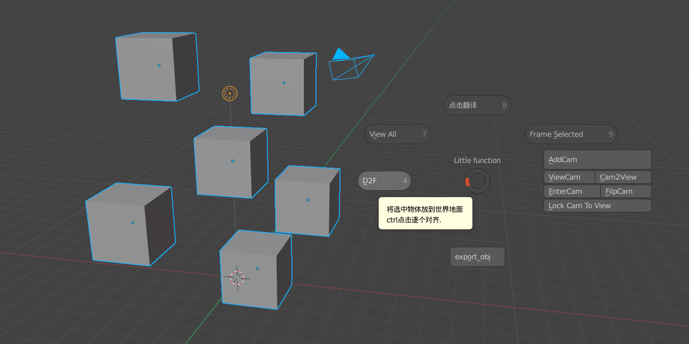

# Little function V 0.26

### [blender 2.8+ addon ]

#### V 0,26：

1. **d2f** now can drop select to active(true select)
2. add a render button
3. fix error report

### Intro (EN)

When building my scene,some repeated steps make me not happy…So I make this small addon to improve my workflow.Hope you will like it

UI pie menu in 3d view with **“F”**

+ translate interface by one click

> English is not my native language,so switch between English might be useful

+ **drop to floor** *ctrl ：drop each to floor* **F-D**

> make the object get onto the floor ! also the with camera or lights ,etc (if selected with mesh)
>
> ctrl ：drop each to floor
>
> shift：drop select to active

+ add cam to view *ctrl ：Ortho Cam* **F-A**

> one click add cam to view
> then make it the scene cam
> Ctrl：add ortho Cam 

+ filp cam (x default, ctrl:z ,shift:y) **F-F**

> flip the camera ,helpful for checking the composition of the picture

+ enter selected cam **F-E**

> select one and set it to scene cam and enter it

+ select and export obj (to where your blend file located)

> export selected object ,name with the first obj(a,001,etc)

### Intro CN

在构建场景中，经常会做一些重复的步骤，就把这些步骤制作为简单的插件

插件将命名为 Little function，即小功能合集

可以在3D视窗中**按F键**呼出饼菜单

+ 一键翻译

    > 在搜索命令和节点上，英文版更为直观，多看中英对照有利于快速上手英文版

+ **drop to floor** *ctrl ：drop each to floor*  **F-D**

    > 以最低物体为基准，将所选网格对齐世界地面
    > Ctrl ：逐个物体对齐地面
    >
    > Shift : 将选中的物体对齐到激活物体（橙色）的顶端

+ 视角添加相机 *ctrl ：Ortho Cam*  **F-A**

    > 免去繁琐的 "shift a添加相机，进入相机，调整相机到位"的步骤
    >
    > 直接在当前视角生成并进入相机
    >
    > Ctrl：添加正交摄像机 

+ 相机翻转 (x default, ctrl:z ,shift:y) **F-F**

    > 镜像翻转

+ 进入所选相机视角 **F-E**

    > 进入选中的相机

+ 导出所选为obj (到blend文件目录下)

    > 以选中的第一个物体的名字 [字母排序为准] 为文件名，导出为obj格式到blend文件目录下
    > 免去选择路径和键入命名的步骤，更加方便管理