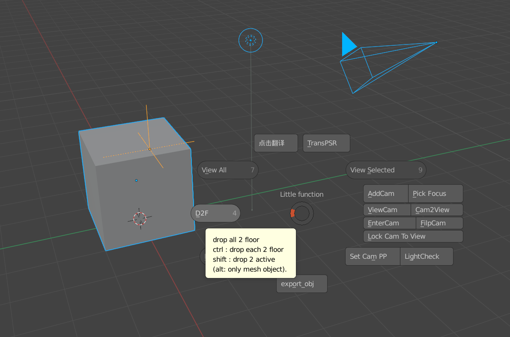

# Little function [free version]

### Pose your object & Set your shot *In Few Clicks*

[blender 2.8+ addon ]

#### V 0.32：

1. fix code, add license

### Intro (EN)

When building my scene,some repeated steps make me not happy…So I make this small addon to improve my workflow.Hope you will like it. ***This will be the last free version.***

在构建场景中，经常会做一些重复的步骤，就把这些步骤制作为简单的插件
插件将命名为 Little function，即小功能合集。希望你喜欢它. ***这将是最后一个免费版本***

UI pie menu in 3d view with **“F”**

+ PSR transform

    > transform (*now Location ) selected obj to active object(at least 2 object)
    >
    > **ctrl** ：trans rotation & location
    >
    > **shift** ：trans scale & location
    >
    > **ctrl shift**： PSR transform
    >
    > (**alt**: not trans location)  *work with ctrl shift*

+ translate interface by one click

	> English is not my native language,so switch between English might be useful

+ **drop to floor**  **F-D**

    > make the object get onto the floor ! also the with camera or lights ,etc (if selected with mesh)
    >
    > **ctrl ：**drop each to floor
    >
    > **shift：**drop select to active
    >
    > (**alt ：**only effect mesh object )  *work with ctrl shift*

+ **add cam to view**  **F-A**

    > one click add cam to view，then make it the scene cam
    >
    > **Ctrl：**add ortho Cam 
    >
    > **shift：**add Cam that look at the select object

+ filp cam（x axis default）  **F-F**

    > flip the camera ,helpful for checking the composition of the picture
    >
    > **ctrl:** z  axis
    >
    > **shift:** y axis

+ enter selected cam **F-E**

    > select one and set it scene cam then enter it
    >
    > **shift** ： popup a cam list to enter
    > 
    > > Thanks to Osama Arafa's Camera_SwitchMenu
    > > Help me learned to call ops in ops

+ select and export obj (to where your blend file located)

    > export selected object ,name with the first obj(a,001,etc)

+ **pick focus**

    > enable dof and pick the foucus on mesh 
    >
    > **shift **: generate a target[name with cam] at the point you pick 

+ light check/look

    > swith contrast look /false color to check the lighting of the scene

### Intro CN

**中文介绍视频：https://www.bilibili.com/video/BV1b54y1q7dd**

可以在3D视窗中**按F键**呼出饼菜单

+ PSR 转移

    > 将所选物体转移位置到激活物体上
    >
    > **ctrl** ：位置和旋转转移
    >
    > **shift** ：位置和缩放转移
    >
    > **ctrl shift**： PSR 转移

+ 一键翻译

    > 在搜索命令和节点上，英文版更为直观，多看中英对照有利于快速上手英文版

+ **drop to floor**  **F-D**

    > 以最低物体为基准，将所选网格对齐世界地面
    > **Ctrl** ：逐个物体对齐地面
    >
    > **Shift** : 将选中的物体对齐到激活物体（橙色）的顶端
    >
    > **alt** ：只对网格物体作用（配合使用）

+ **视角添加相机**   **F-A**

    > 免去繁琐的 "shift a添加相机，进入相机，调整相机到位"的步骤，直接在当前视角生成并进入相机
    >
    > **Ctrl**：添加正交摄像机 
    >
    > **shift**：对激活物体添加一个朝向摄像机

+ 相机翻转  **F-F**

    > 镜像翻转 默认x轴向，**ctrl,shift** 可翻转 y,z 轴向

+ 进入所选相机视角 **F-E**

    > 进入选中的相机
    >
    > **shift**: 弹出相机菜单

+ 导出所选为obj (到blend文件目录下)

    > 以选中的第一个物体的名字 [字母排序为准] 为文件名，导出为obj格式到blend文件目录下
    > 免去选择路径和键入命名的步骤，更加方便管理

+ 拾取焦点

    > 在所点击的位置设置对焦点（自动打开景深）
    >
    > **shift **：在对焦点生成一个以相机命名的空物体作为对焦物体

+ 灯光检查

    > 设置不同的对比度/false color 来检测场景
